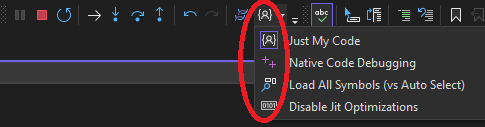

# Just My Code Toggle extension for Visual Studio 2015+

This primary goal of this extension is to add the **Debug.JustMyCodeToggle** from the options menu to the Visual Studio main window. By default, the command appears in the **Debug** toolbar as well as in the context menu for the **Call Stack** window.  It also adds a few other setting commands in the toolbar using a split-button to toggle: Native Code Debugging, All Symbols / Selective Symbol loading, Disable .NET and JIT code optimization for external code or release builds for better preservation of variables/stack items normally optimized away.

JustMyCode toggle can be changed while debugging but the others will only take effect on the next debug session.

### Debug Toolbar

The toolbar also features a few other toggles including:
- Native Code Debugging - The debug properties debug native code option (stored in the .csproj.user file)
- All Module Symbol Loading - Toggle between VS trying to only load symbols for needed files/modules or loading for all modules ( this is the Options->Debugging->Symbols  "Automatic searching symbols" dropdown )
- Disabling native / managed code optimization - Better debugging for native/3rd party code to preserve stack and variables (Only for new CPS style projects with launch profile support, as we need to set env vars).  Env vars are stored in the launch profile but are deleted when you toggle this back off. This is similar to / slightly more robust than the Debugging-> use of precompiled images (which I couldn't find).

### Call Stack Window

### Keyboard

By default, the new command is not bound to a keystroke. A key binding may be added manually by configuring a binding for any of the following commands:
- Debug.JustMyCodeToggle
- Debug.JMCSymbolLocalToggle
- Debug.JMCNativeCodeDebugging
- Debug.JMCDisableJitOptmizations
